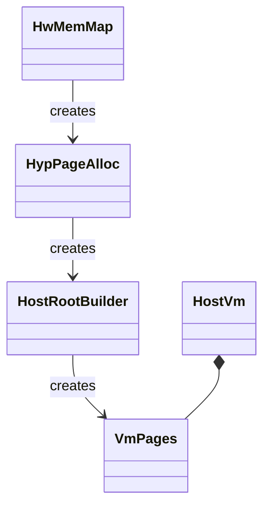
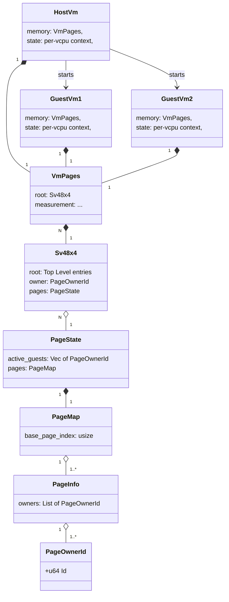
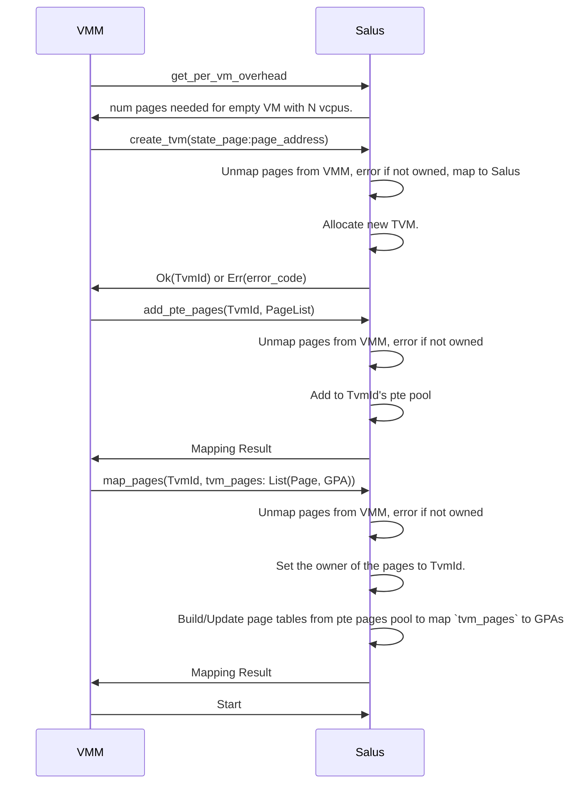

# Memory Initialization

At startup memory layout is discovered from the device tree and used to build
Salus local structures, local Host Data, then to start the host VM as shown
below:

`HwMemMap` holds the memory configuration of the system. It is created using
the device tree as input. It is then converted in to a `HypPageAlloc` struct
that is used to allocate the pages needed for the hypervisor. After the
hypervisor has taken it's pages, the remaining pages in `HypPageAlloc` are
moved in to `HostRootBuilder`, which is used to build the host Vm and its
`VmPages` structure.

# Memory ownership

Ownership of memory is tracked on a per-page basis. Each page is assigned an
owner with a unique ID. Pages are assigned to VMs by mapping them to the VM
page table. In addition, a previous owners list is maintained per page.

The basic structures used to manage page ownership are outlined as follows:

The type [`PageOwnerId`]() represents a unique identifier for each entity that
can own a page. This owner can be the hypervisor, the host, or any guest
started by the host.

A [`PageInfo`]() is created for each `Page`. It contains the current owner of
the pages as well as a record of the owners that loaned the page if it wasn't
the host. Initially, the list of owners will be only two deep (this allows one
layer of nesting without forced address space walks on guest exit).

The type [`PageMap`]() is a thin wrapper around a Vec of `PageInfo`s, one per
page in the system. It allows indexing the pages by a page address.

[`PageState`]() is a system-side singleton that contains `Pages` and a list
of active page owners (VM guests).

A [`Sv48x4`]() is created for each running VM. This tracks the page table for
the VM (with the 4, 16k-aligned pages for hgatp referenced by `root`). This is
the entity that is assigned a unique `PageOwnerId` for the VM and it maintains
a reference to `PageState` for checking which pages are assigned to it and
for sharing pages with child VMs it starts.

[`VmPages`]() is a per-VM structure that has an `Sv48x4` and the measurement of
all data pages that were added to the page table before it was finalized.

[`HostVm`]() and [`GuestVm`]() combine a page table for the guest (`VmPages`) and the
per-cpu register state of the VM to provide functionality that runs the VM.

## Donating pages to guests

# Memory assignment/sharing flows for TVMs and the hypervisor

Salus starts by setting up local data structures and marking the memory used
for that data as owned by the hypervisor. This will be enough to map all memory
to the host and track its state. State for guest VMs will be tracked in pages
donating from the VM that creats the guest.

The owners list allows VMs to fault in pages that were previously loaned to
child VMs.

## Adding memory flow

## Loaned memory tracking.

Assigning a page from a VM to a child:
1. Mark the PTE for the parent VM as invalid (V=0).
2. measure or clear the page - depending on if it's a data or zero page.
3. insert child vmid at the front pages[pageidx].owners
4. set valid PTE in child.

Parent reclaim from child:
1. parent asks for a page back
2. find PTE entry in child and clear it
3. clear page
4. pop owner from pages[pageidx].owners
5. set valid bit in parent PTE

On child exit:
1. parent sends destroy message
2. remove child from guest VM list
3. destroy child page table
4. PTEs for parent are left as invalid to be demand-paged back in(avoids finding every page).

Parent page fault for page assigned to exited child
1. parent tries to access page
2. lookup owner in pages[pageidx] == parent id set V=1 in parent PTE.
