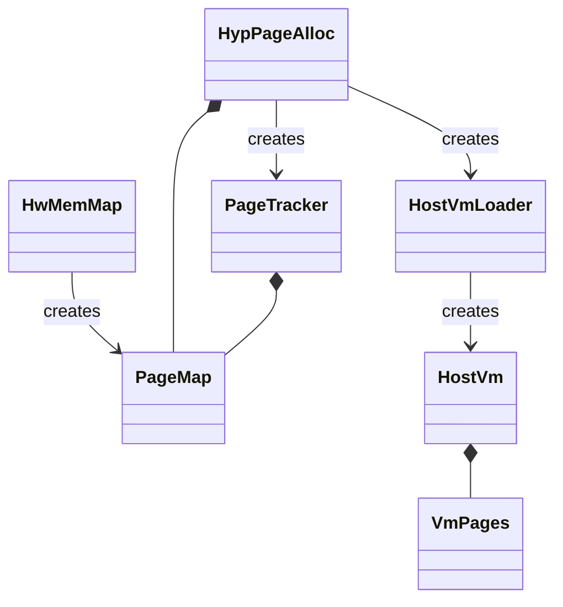
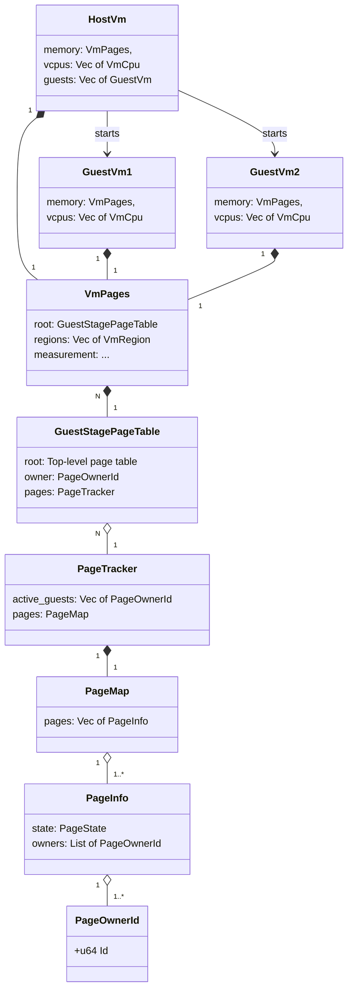
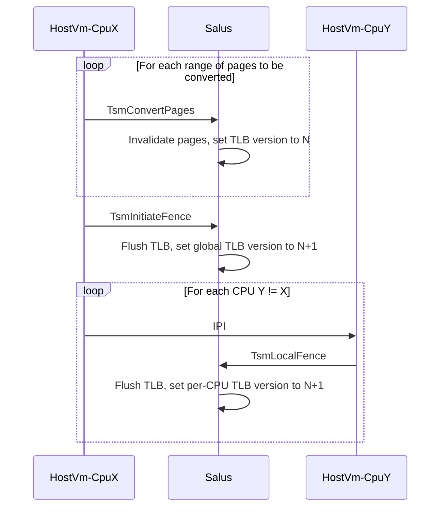
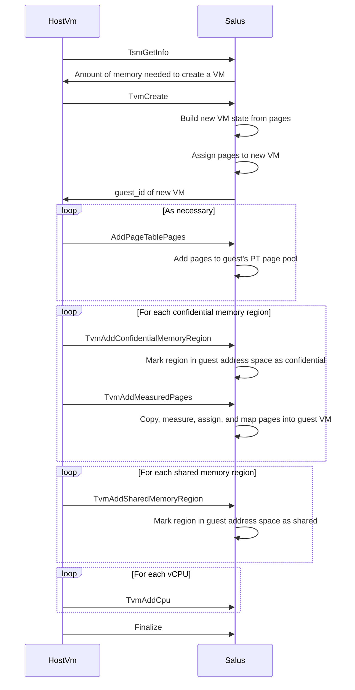
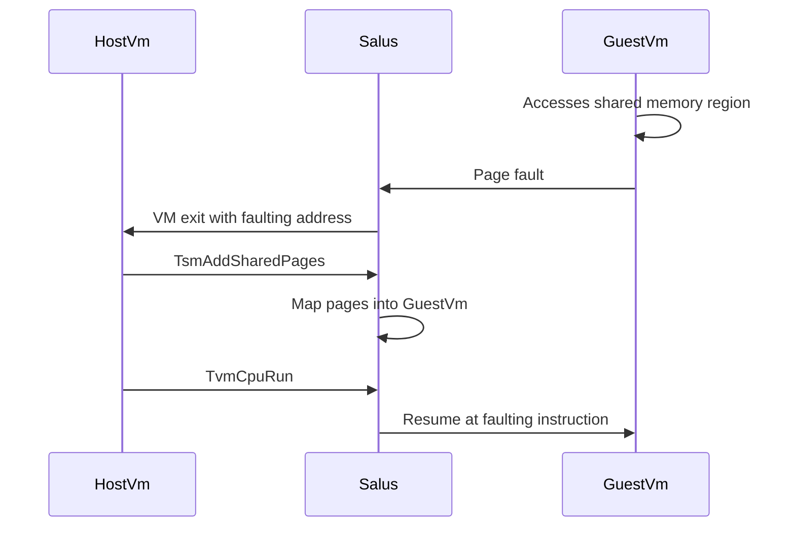
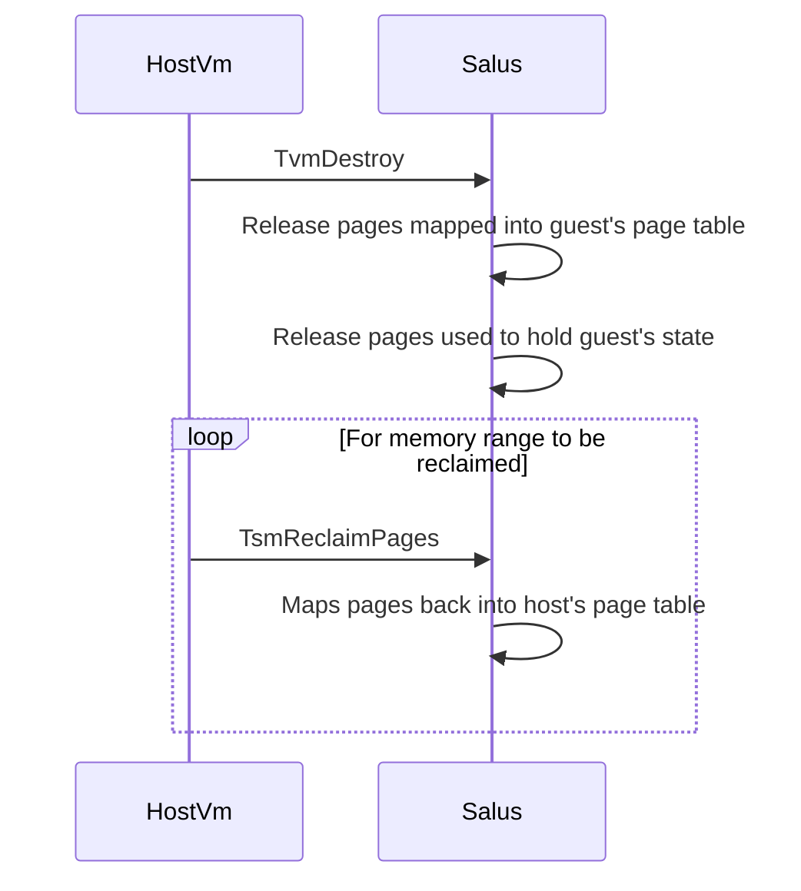
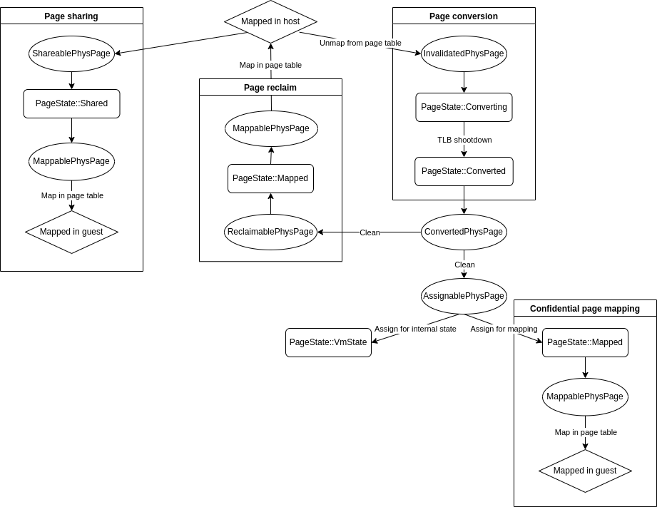

# Memory Initialization

At startup, memory layout is discovered from the device tree and used to build
Salus global data structures, per-VM internal data structures for the host VM,
and the address space of the host VM.

`HwMemMap` holds the map of the system's physical address space, including
which ranges of ordinary RAM are usable or reserved, and which regions of the
address space are used for MMIO. It is created using the device tree as input.

`HwMemMap` is used to create and initialize `PageMap`, which holds onwership,
typing, and the current state of each physical 4kB page in the system. A boot
time page allocator, `HypPageAlloc`, then uses `PageMap` to find and allocate
free RAM pages for Salus-internal use. Once initialization has completed and all
boot-time allocations have been made, the remaining free pages in `HypPageAlloc`
are used to create `HostVmLoader`, which is to load and launch the host VM,
and `PageTracker`, which uses `PageMap` to coordinate memory ownership
and state transitions at runtime.

`HostVmLoader` creates `HostVm`, which holds the Salus-internal state of the
host VM. `HostVm` is itself composed of `VmPages`, which manages the guest
physical address space of single VM. The remaining free pages are used as physical
memory for the host VM.

Upon completion, `HostVm` is launched.

# Memory ownership

Ownership of memory is tracked on a per-page basis. Each VM is assigned a unique
64-bit ID, and this ID is used to map individual pages to the VM that owns them.
Pages change ownership when the owning VM assigns the page for use in a child VM.
Pages return to the parent of the owning VM when the owning VM is destroyed.
Initially all pages are either owned by Salus (for hypervisor-internal usage)
or the host VM.

The basic structures used to manage page ownership are outlined as follows:

The type `PageOwnerId` represents a unique identifier for each entity that
can own a page. This owner can be the hypervisor, the host, or any guest
started by the host or its descendents.

A `PageInfo` is created for each `Page`. It contains the current owner of
the pages as well as a record of its previuos owners. Initially, the list of
owners will be only two deep, allowing for one layer of nesting. Each
`PageInfo` also contains the current state of a page as represented by a
`PageState` enum.

The type `PageMap` is a thin wrapper around a Vec of `PageInfo`s, one per
page in the system. It allows indexing the pages by a page address.

`PageTracker` is a system-side singleton that contains `PageMap` and a
list of active page owners (VM guests).

A `GuestStagePageTable` is created for each running VM and is used to
manage the 2nd-stage translation tables for the VM, with `root` pointing to
the 16kB root page table of the paging hierarchy. This is the entity that is
assigned a unique `PageOwnerId` for the VM and it maintains a reference to
`PageTracker` for checking which pages are allowed to be mapped or unmapped
from the VM.

`VmPages` is a per-VM structure that has a `GuestStagePageTable` and
a `VmRegionList`, which tracks the parts of the physical address space are
eligible to be used for confidential or shared memory. `VmPages` is used to
coordinate the assignment, reclaim, or sharing of pages with a child VM.
It also contains the measurement of all data pages that were mapped into the
VM before it was finalized.

`Vm` combines a page table for the VM (`VmPages`) and the per-vCPU
(`VmCpu`) state.

With the exception of shared pages, which can be simultaneously mapped into
multiple VMs, each page must either be uniquely mapped into the address space
of the owning VM or used to hold internal state for the owning VM.

# VM address space

A guest VM's physical address space is made up of distinct, non-overlapping
regions which determine what kinds of pages may be mapped into the region and
how Salus responds to page faults taken in that region. These regions are
defined during VM initialization and their size or location cannot be changed at
runtime. Currently there are three types:

- `Confidential`: Memory that is confidential to the VM. Any pages mapped in
a confidential region are considered to be owned by the VM and are guaranteed to
be inaccessible to the VM's parent. Data pages, or pages initialized with
parent-provided contents, are measured as they are added and may only be added
prior to VM finalization. Zero-filled confidential pages may be added at any
point. Page faults in a confidential region trigger an exit to the VM's parent
with the faulting address.

* `Shared`: Memory that is shared with the VM's parent. Pages in a shared
memory region are considered to be owned by the parent VM, and the parent VM
may share the same page wtih as many child VMs as it likes. Shared pages may
be inserted at any time, and their initial contents upon being mapped into a
child VM is undefined. Page faults in a shared region trigger an exit to the VM's
parent with the faulting adddress.

* `Mmio`: Memory that is not backed by physical pages, but instead is used to
emulate MMIO between a VM and its parent. Accesses by a VM to an MMIO region
trigger an exit to the VM's parent, with Salus providing details of the trapping
load or store to the parent so that it may complete the emulated MMIO operation.

## Page tables

The 2nd-stage page tables for a VM are accessible only to Salus, Pages may only
be mapped in a page table under the explicit direction of a VM or its parent,
and pages may only be unmapped from a page tabel under explicit direction of
the VM itself.

The pages used for the root of the paging hierarchy are assigned at VM creation
time, while pages used for intermediate page tables are kept in a pool. The VM's
parent may add (converted) pages to the VM's page-table page pool at any time.
All pages used for paging structures are considered to be owned by the VM whose
2nd-stage page tables they compose.

# Memory assignment/sharing flows

Salus starts by setting up local data structures and marking the memory used
for that data as owned by the hypervisor. This will be enough to map all memory
to the host and track its state. The host may then assign memory for use
exclusively by a guest VM, or it may also share its memory with a guest VM
(e.g. to support para-virualized I/O). A VM must also be able to reclaim the
memory that it assigns to any of its guest VMs after the guest VM is destroyed.

## Memory conversion

In order for a host VM to donate (assign) pages in its address sapce to a
guest VM, the host must first _convert_ the pages. The conversion process,
outlined below, results in the pages being made inaccessible to the host VM
by invalidating them from the 2nd-stage page tables and coordinating a TLB
shootdown. Once a page is converted, it may then be _assigned_ for use in a
guest VM. Note that converted memory that has yet to be assigned to a guest VM
is still considered to be owned by the host VM.

Salus enforces that the TLB flush has been completed by maintaining a reference
count on the TLB version. Once the flush has completed, the converted pages are
available to be assigned to a child VM.

## VM creation

Guest VMs are constructed from pages converted by the host VM. When constructing
a guest VM the converted pages are assigned a particular puprose, either to hold
internal state or to be mapped into the address space of the guest. Once a page
is assigned, it is considered to be owned by the guest VM until the guest VM is
destroyed or the guest VM assigns the pages to a nested guest VM it creates. The
VM creation process is outlined below.

After VM finalization, the guest VM's address space layout is locked and no more
measured pages may be added. The VM is now runnable and the host VM may run a
guest VM vCPU with `TvmCpuRun`.

## Memory sharing

It is expected that the shared memory regions of a VM will typically be
unpopulated to begin with, with the host VM only inserting shared pages when
the guest VM takes a page fault in a shared memory region. This procedure is
outlined below:

A similar procedure is followed to add zero-filled confidential pages at runtime.
The pages to be inserted must have first been converted by the host VM, however.

## VM teardown and page reclaim

When a guest VM is destroyed, any pages used to store its internal state and
any pages mapped as confidential memory into its address space are returned to
the host VM. The pages are still considered to be converted, and may be
immediately re-assigned by the host VM to another guest VM. Otherwise the host
VM may _relcaim_ the pages, which maps the pages back into the host VM's
address space. The destroy and reclaim process is shown below:

# Page state machine

Within Salus, the state of a page is tracked in two complementary ways:
- The per-page `PageState` enum in `PageTracker`, which is used to track
the "resting state" of a particular physical page.
- Traits and type-states of the `PhysPage` object, which represents an
exclusive reference to a page of memory. These traits and type-states are used
to enforce type-safe page state transitions via the `PageTracker` API.

The below state diagram shows the transition between `PageState` states and
the intermediate `PhysPage` types used to move a `PhysPage` between these
states.

Each implementation of `PhysPage` (the most notable of which being `Page`,
which represents a page of ordinary RAM) use type-states to encode what state
the page is in and which `PhysPage` type traits are satisfied by that state.
For example, a `Page<ConvertedDirty>` is a `ConvertedPhysPage` since it's
a page in the `Converted` state. It's not an `AssignablePhysPage` however
since pages cannot be assigned until they are cleaned (`Page<ConvertedClean>`)
or initialized (`Page<ConvertedInitialized>`).
